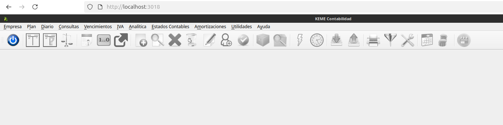

Esta imagen ejecuta [Keme Contabilidad](https://keme.sourceforge.io/) en un contenedor docker y expone un cliente de escritorio remoto para control desde un navegador web.

# License
Este es software libre y sin compromiso publicado en el dominio público.

Cualquier persona es libre de copiar, modificar, publicar, usar, compilar, vender o
distribuir este software, ya sea en forma de código fuente o como binario,
para cualquier propósito, comercial o no comercial, y por cualquier
medio.

En las jurisdicciones que reconocen las leyes de derechos de autor, el autor o autores
de este software dedican cualquier y todos los derechos de autor del
software para el dominio público. Hacemos esta dedicación para el beneficio.
del público en general y en detrimento de nuestros herederos y
sucesores. Pretendemos que esta dedicación sea un acto manifiesto de
renuncia a perpetuidad de todos los derechos presentes y futuros de esta
software bajo la ley de derechos de autor.

EL SOFTWARE SE PROPORCIONA "TAL CUAL", SIN GARANTÍA DE NINGÚN TIPO,
EXPRESA O IMPLÍCITA, INCLUYENDO PERO NO LIMITADA A LAS GARANTÍAS DE
COMERCIABILIDAD, APTITUD PARA UN PROPÓSITO PARTICULAR Y NO INCUMPLIMIENTO.
EN NINGÚN CASO, LOS AUTORES SERÁN RESPONSABLES POR CUALQUIER RECLAMACIÓN, DAÑOS O
OTRA RESPONSABILIDAD, YA SEA EN UNA ACCIÓN DE CONTRATO, TORT U OTRA MANERA,
DERIVADO DE, FUERA DE O EN RELACIÓN CON EL SOFTWARE O EL USO O
OTRAS REPARACIONES EN EL SOFTWARE.

Para más información, consulte <http://unlicense.org/>